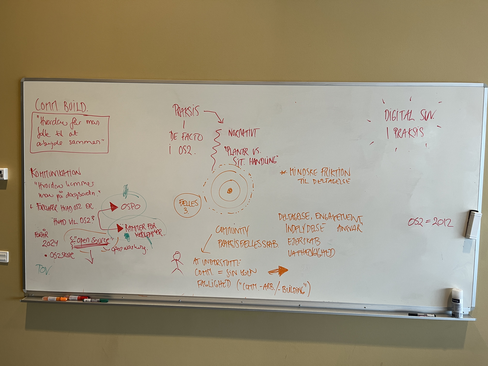

# Kommunikation, crowdfunding & community building v. Sisse (kl.12-13)

Formål: at jeg får en forståelse for hvordan man arbejder med kommunikation, crowdfunding & community building i OS2.

Spørgsmål:
Hvordan får du folk til at arbejde sammen? 
Hvad er de største udfordringer? 
Hvordan organiserer man sig, i en decentraliseret forening? Og mulige udfordringer ved det?
Hvordan undgår man at fremstå som en leverandør?
Hvordan får man taletid, kommer på dagsorden ift. DK's digitale suverænitet? 
Hvordan er forholdet mellem intern og ekstern kommunikation og branding? 

# Noter fra mødet

Opsummeret med Mistral AI   

---

## Noter fra mødet

### Digital Suverænitet (SUV)
- Ingen fælles betegnelse – en *"empty container"*, hvor alle kan putte deres forståelse ind.
- **Praksis**: Ikke en endelig tilstand, men en **løbende proces**.
- **Historisk kontekst**:
  - Forår 2024: **Chromebook-sagen** som national markør for digital SUV i Danmark.
  - **OS2-skole** etableret som reaktion herpå.

---

### Kommunikationsstrategi i OS2
- **Skift i strategi**:
  - Før: Forklare *"hvad er open source?"* (ikke altid hensigtsmæssigt for kommunerne).
  - Nu: **Associationskraft** – folk forstår OS2 og open source i lyset af **digital SUV og Chromebook-sagen**.
  - **Udfordring**: *"Open washing"* (misbrug af open source-begrebet som følge af politisk fokus).

- **Tone of Voice (TOV)**:
  - **Øjenhøjde**, humor og **menneskelig tilgang** (Sisses kernekompetence).
  - **Branding**: Skabe en **oplevelse af at være del af noget større** (aktivitet og relation til OS2-verden).

- **Prioriteringer**:
  - **Uddannelse og oplevelser** > LinkedIn-opslag.
  - **Korrekthed vs. læselighed**: Hvad er vigtigst i et nyhedsbrev? At det er **korrekt** eller at folk **læser det**?

---

### Community Building
- **Definition**:
  - **IKKE** = at få folk til at arbejde sammen.
  - **IKKE** = fællesskab.
  - **Community** = **Praksisfællesskab**, hvor medlemmer får:
    - Indflydelse
    - Ejerskab
    - Uafhængighed
    - Deltagelse i digitaliseringsprocessen (et "tog man må springe på").
  - **Fælles**: At man har **noget til fælles**.

- **Community Building** = **Faglighed** i at understøtte dette arbejde.

- **Udfordringer**:
  - **Friktion til deltagelse**: Svært for "menneske-mennesker" (dem der forstår det bløde/fluffy), nemmere for IT-folk.
  - **Motivation**: Medarbejdere vil helst **undgå shitstorms**, leve op til forpligtelser, og minimere risici – **udvikling kommer først bagefter**.
  - **Gulderod**: *First movers/front runners* kan inspirere andre kommuner.

---

### Organisation og Kultur i OS2
- **Struktur**:
  - **Decentraliseret forening** med **uorganiserede bevægelser**.
  - Beslutninger sker **ad hoc** (baseret på vaner, kultur, forståelser).
  - **OS2** = Politik, kultur, kulturbærere, beslutningstagere, ildsjæle.

- **Lucy Suchmans teori**:
  - **Plan vs. situeret handling** – OS2 opererer i en **dynamisk spænding** mellem struktur og spontanitet.

- **Blindspot (iflg. Sisse)**:
  - Alle er **individuelle mennesker** med egne behov.
  - En **god ide (ideologisk)** er ikke nødvendigvis god for **den enkelte medarbejder**.

- **Sisses vision for OS2-sekretariatet**:
  - **Understøtte medlemmerne** med **rammer**.
  - **Etablere fælles sprog og forståelse**.
  - **Italesætte huller og selvmodsigelser** i organisationen.

---
### OSPO vs. Rammer for Medlemmer
- **Spørgsmål**: Skal OS2 være et **OSPO (Open Source Program Office)** (politisk, Christiansborg) eller **rammer for medlemmer**?
- **Konsekvens for kommunikation**:
  - Hvis OS2 skifter strategi mod **OSPO**, skal kommunikationen tilpasses (f.eks. stoppe med "vitigheder").
  - **Nuværende formål**: Rammer for medlemmer.

---
### Små greb til forbedring (iflg. Sisse)
- Alle arbejdsgrupper skal igennem **community building**:
  - Start med at **tænke i deltagelse og friktion**.
  - **Eksempel**: Et nyhedsbrev bør prioritere **læselighed** frem for perfektion.

---
---
## Kernekonklusioner
1. **Digital Suverænitet** er en **praksis**, ikke en endelig tilstand. OS2 skal **holdes i bevægelse** for at forblive relevant i **storpolitik og samfundsdebat**.
2. **Community Building** handler om at skabe **rammer for praksisfællesskaber**, hvor medlemmer føler **ejerskab, indflydelse og uafhængighed**. **Fælles** betyder, at man har **noget til fælles**.
3. **Kommunikation** skal være **menneskelig, i øjenhøjde og engagerende** – prioriter **oplevelser og uddannelse** frem for formelle opslag.
4. **OS2’s kultur** er **decentraliseret og uorganiseret**, men det er netop her, **beslutninger sker organisk** (Lucy Suchmans *situeret handling*).
5. **Motivation** blandt medarbejdere er ofte **risikominimering** – **udvikling kommer først, når overskuddet er der**.
6. **Sisses anbefaling**:
   - **Fokuser på fælles sprog, forståelse og italesættelse af huller** for at styrke organisationen.
   - **Storpolitisk indflydelse** kræver, at OS2 **formår at komme på dagsordnen** som en central aktør i debatten om digital suverænitet. 

<!--
# Noter fra mødet

digital suverænitet = har ingen fælles betegnelse, bare folks forskellige fornemmelser; en empty container alle kan putte deres ned i; og digital suveræn er ikke noget man kan blive/være endeligt, det er en praksis 

foråret 2024 cromebook sagen som national markør til digi suv i DK, OS2skole blev etableret som reaktion 

skift i kommunikationsstrategien: 
- gik fra behov for at forklare "hvad er open source"
    - (hvilket var fedt for Sisse, for hun måske det ikke altid har været hensigtsmæssigt vej ind for kommunerne; ikke forklaringen af OS der får folk til at springe ud af stolen og joine OS2 alligevel)
- -> efter cromebooksagen + og digi suv kom på dagsordenen havde folk en association, når de da hørte om os2 og open source (men open washing blev også en konsekvens af det store politiske fokus heraf)

forklaringsmodeller for 'hvorfor tingene er som det er i dag i os2' - ville kræve en lang og detaljeret analyse 

for sisse at se er OS2 = politik, kultur, kulturbærerer, beslutningstagere, ildsjæle -> i ét stort uorganiseret bevægelse, beslutninger sker bare (alt det usynlige; vaner, kultur, forståelser)

blindspot iflg. Sisse: vi er alle bare mennesker, og individuelle mennesker i individuelle stillinger, som har egne behov 
en god ide ren ideologisk (som proposed af OS-evangelisten) er ikke nødvendigvis en god ide for *mig* 
kan man gøre det sværre at LADE hver med at gøre tingen "open source" - for at få folk til at joine? //fx gøre det ulovligt at bruge microsoft 
motivationer for medarbejdere: susanne og Hermann vil ude i deres kommuner gerne undgå shitshow/shitstorm, leve op til deres forpligtelser for hvad de *skal* nå, træde varsomt ift at dække sig ind for sikkerheds og risk-minimering – og først derefter er man måske heldig at de har overskud til at *udvikle* og være en del af et community hvor der kræves noget ekstra af dem 
en sjælden gang imellem kan en gulderod være: first movers/front runners for at få kommuner med 

hvor skal det komme fra? 

det er et kæmpe skifte, folk forstår det kræver noget reel indsats - men er de villig til at gøre den 

situeret handling i sekretariet: hvornår findes noget , gælder noget det er dokumenteret, gælder noget det når det sker, ? <!-- ideologi vs.  
den tænkte realitet (alle har i deres hoveder)
alle har deres egen virkelighed - tydelige rolleafklaring, accountability, > som 

sisses 2 cents hvis hun måtte bestemme: 
- os2 sekretariatet skal understøtte medlemmerne (rammer) -> lægge stor vægt på at etablere fælles sprog, forståelse for hvad vi laver over hele linjen  - start med at italesætte hullerne, hvor de er selvmodsigende - hvordan giver vi dem mulighed for selv at arbejde med deres praksisfællesskab 
- hvis valget for sisse står imellem at lave et linkedin opslag eller gi nogen en god oplevelse/uddanne dem; så er pengene brugt bedre with the latter 

Sisses rebranding af sproget i os2s kommunikation - tone of voice TOV, meget i øjenhøjde, jokes etc 
branding tankegang: aktivitet og relation til os2-verden , en oplevelse af at være med i noget 

hvad er vigtigste i et nyhedsbrev - at det står korrekt eller at folk læser det ? 

det her ubeskrivelige og fluffy er sisses kerne kompetence - men det er limen i OS2 

kommunikation - før man kan forklare hvad OS2 er, bliver man nød til at svare på "hvad vil os2" vil det fx være et OSPO (se forklaring her: ) eller nogen der skaber rammer for medlemmer (pt formål)
hvis os2 vil ændre strategi, så skal kommunikationen tilpasses - og i så fald vil sisse stoppe med vitigghederne hvis man vil være et OSPO (politisk, christiansborg) og ikke bare rammer for medlemmer

**DEFINITIONER/WORD BANK:**

community building er IKKE ≠ det samme som at få folk til at arbejde sammen og heller ikke ≠ fællesskab 

community = **praksisfællesskab**, hvor man får adgang til at deltage/engagement/ansvar i: indflydelse, ejerskab, uafhængighed → er i bevægelse og tapper løbende ind i en virkligehed af et tog der kører med digitaliseringen/digital suv som man må springe på 

community building = sin egen faglighed at understøtte community arbejde 

man ville komme rigtig langt, hvis folk forstår at de skal gøre arbejdet for at communitet udvikler sig

adgangen til open source, github og versionsstyring: for menneske-mennesker (dem som forstår sig på det fluffy, bløde, at bygge communities) er svær, men nemmere for it-personer der kan kode 

små greb: ifølge Sisse - alle arbejdsgrupper skulle igennem community building "start med at tænk i det her" fx mindske friktion til deltagelse, 

et nyhedsbrev som eksempel på planer vs. situeret handling

-->
