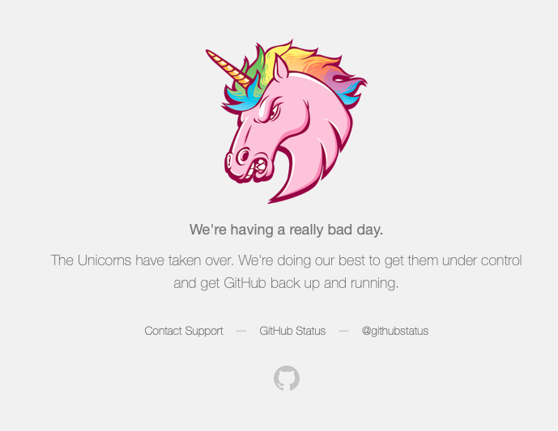
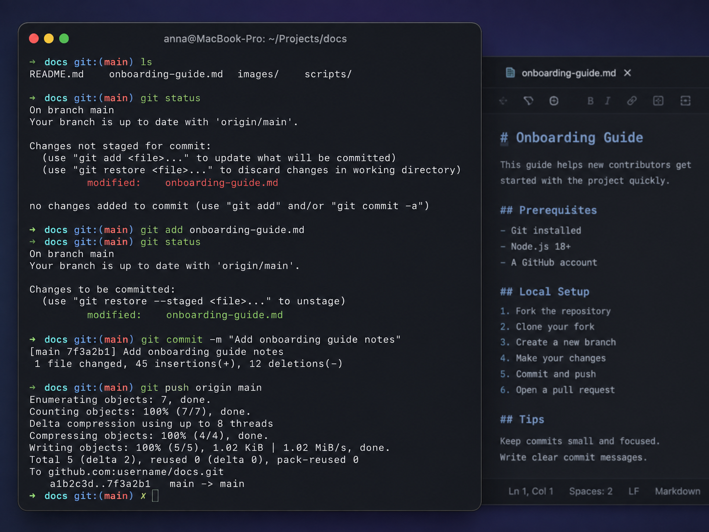
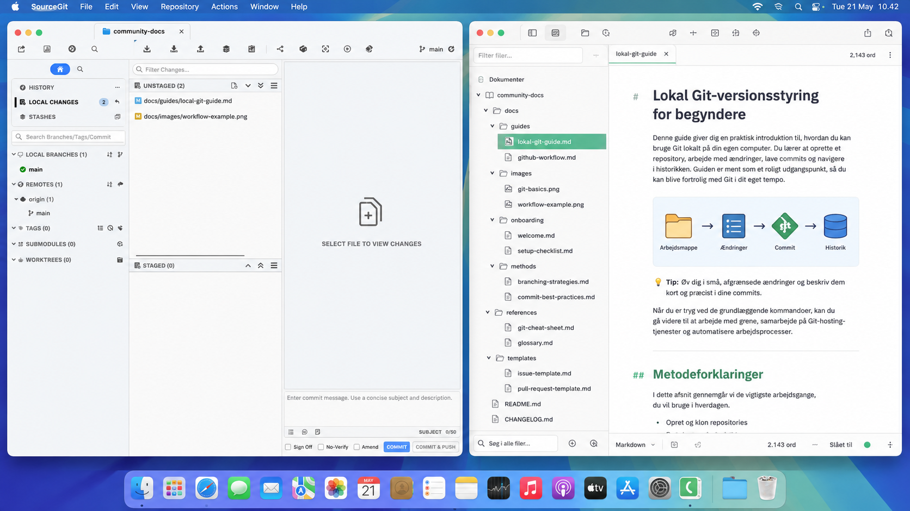

# Prompt fra Jan

"Har sovet lidt på hvordan jeg bedst mulitg hjalp dig igang med lokal github... Har du plads i din plan til at vi udvidder scopet lidt til et mere genbrugeligt stykke arbejde?

Du kan skrive en intro fra dit perspektiv med din nylige "horror-story" som eksempel afsæt...\
Jeg kan komme med en hurtig intro med nogle metode forklaringer, og evt. en mapning til et enkelt værktøj eller to ...

Derefter udvidder vi det med at du stiller alle de spørgsmål du ville forestille dig en projektkoordinator ville kunne finde på at stille og alt det de vil sætte i tvivl og kritisere ud fra deres forandringsfrygt...

Produktet bliver et målrettet dokument til håndbogen, som vi skriver sammen iterativt, du holder format og formidling og jeg bringer the Why and the How til bordet..."

vi holdte møde d.24/8 og fandt frem til følgende: 

# Lokal git versionsstyring for dummies
*af Anna Matthäi Leland, specialestuderende hos OS2* 

*Ny i open source verden - fx stadig Mac-bruger. Et skridt af gangen hen mod fri teknologisk handlekraft...*

Denne guide er affødt af en dramatisk eftermiddag, hvor GitHub gik ned, og jeg mistede noter fra et 2,5 timers møde, som jeg havde skrevet i GitHubs online editor, men ikke nået at committe - mine noter var tabt.

FOSS-enterprisearkitekten Jan siger selvfølgelig: "Jamen så er det vel på tide, du kører Git lokalt på din PC. Og løsriver dig fra Microsofts greb."

_Så here we go:_

## Metodeforklaringer

Det ville Jan byde ind med?

"Jeg kan komme med en hurtig intro med nogle metode forklaringer, og evt. en mapning til et enkelt værktøj eller to ..." 

"the Why and the How"

gætter på det er forklaringer af Git vs. GitHub, lokalt vs. remote repo, commit, push/pull, versionshistorik og hvorfor lokal Git giver mere kontrol/ robusthed?

## Værktøjer til at køre Git lokalt

Hvis man er vant til at skrive sine .md-filer (Markdown) direkte på GitHubs hjemmeside, kan det føles skræmmende at flytte arbejdet ned på sin egen computer.

**Git er selve versionsstyringen. Det kan skrives anywhere. GitHub er bare en online tjeneste, hvor ens Git-repository kan deles. Men du kan ligeså vel arbejde med det lokalt på din egen computer, og pushe det op i GitHub når du vil dele det.**

Hvis man som mig ikke helt har mod på at skrive Git-kommandoer i terminalen, findes der heldigvis programmer, der pakker det tekniske ind i en grafisk brugerflade, en GUI (_graphical user interface_).

*Eksempel på at skrive .md-filer lokalt og versionsstyre med git i terminalen.*

*Eksempel på at skrive .md-filer lokalt i en flot indpakket tekst-editor og versionsstyre med Git gennem Git-klienten SourceGit*

Der findes mange forskellige værktøjer, men ikke alle er FOSS (_free and open source software_). Nogle er proprietære, dvs. de har lukket kildekode og kontrolleres af en bestemt leverandør.

Men hvis pointen med at arbejde lokalt er at blive mindre afhængig af GitHubs online, giver det ikke meget mening bare at skabe en ny afhængighed af proprietær software. Derfor vælger vi FOSS-løsninger.

Jeg har derfor ledt efter en løsning, der er **FOSS, har en grafisk brugerflade og passer til mit behov: at skrive Markdown lokalt og versionsstyre det med Git, så jeg kan dele mit arbejde på GitHub.**

_(Men ville du ikke ud af GitHub? Jo, men GitHub er fortsat den valgte platform til deling af software i OS2 og fungerer jo effektivt, når det kører.)_

Efter at have undersøgt forskellige muligheder er jeg landet på to værktøjer:

* En **teksteditor**, hvor man opretter og skriver i .md-filer. Her har jeg valgt **Zettlr**, som er FOSS og fungerer godt til at arbejde med Markdown-filer og holde overblik over et repository. [Download Zettlr](https://www.zettlr.com/download)

* En **Git-klient med grafisk brugerflade**, hvor man kan se ændringer, committe dem og pushe dem til GitHub. Her har jeg valgt **SourceGit**, som er FOSS og udgivet under MIT-licensen. [Download SourceGit](https://github.com/sourcegit-scm/sourcegit/releases)

.....

**Evt forsæt guiden med hjælp til download af klienten SourceGit og text editoren Zettlr, og forklar hvordan man kloner sit repo ned og bruger Zettlr og SourceGit i kombination...?**