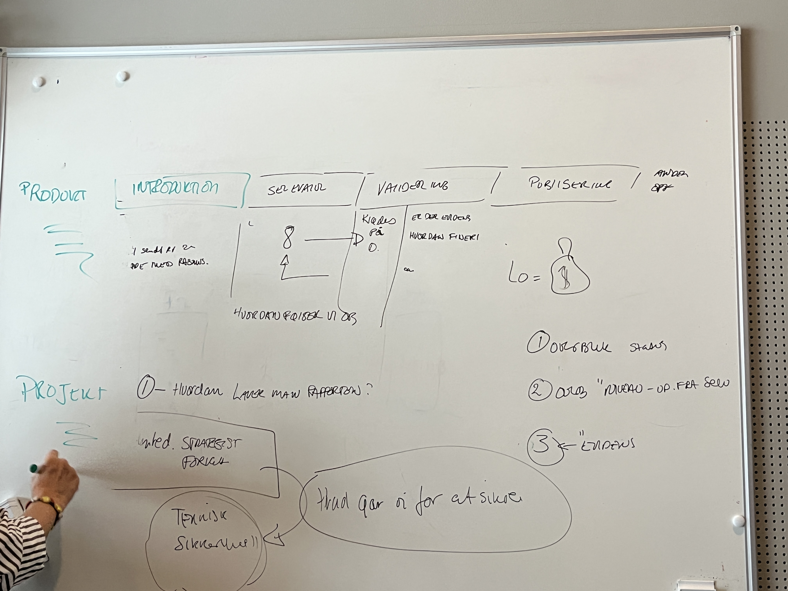

# Kickoff på analyse af selvevalueringer

# Møde med Anna-Lis

Fagligt

* \[ ] Just the docs er oppe og køre: [https://anna-leland.github.io/digi-suveraenitet-i-praksis/ ](https://anna-leland.github.io/digi-suveraenitet-i-praksis/)
* \[ ] Rasmus’ opgaver til mig omkring selv-evalueringer - har AL hørt noget ?
* \[ ] Gennemgå findings fra interview m Jakob [link til noter fra interview](https://github.com/anna-leland/digi-suveraenitet-i-praksis/blob/main/docs/os2forloeb2026/Interviews/noter_interview-med-jakob-thøtt-nørby-selvevaluering-af-os2aiheatcontrol.md)
* \[ ] Genbesøg punkter fra gameplan - balance mellem interviews og dokumentanalyse?
* \[ ] Status på min uni-opgave #1
*  mere? 

Praktisk

* \[ ] Hvor skal underskrevet adgangskort kontrakt afleveres?
* \[ ] Planlægge 1:1 Anna-Lis  og jeg?
* \[ ] Spørg Anna-Lis om transport til digi messen - skal jeg selv bestille togbillet?

## Dokumentanalyse / resultatanalyse (del 1)

*Punkter trukket fra [gameplan](https://anna-leland.github.io/digi-suveraenitet-i-praksis/docs/os2forloeb2026/gameplan2026.html) for september. Del 2 handler om process-analyse*

- **Analyser udvalgte indkomne selvevalueringer**

- **Kortlægning af divergens mellem produktets governance niveau og selvevaluering** 

- **Identificering årssagssammenhæng i "røde lamper" i kravsopfyldelsen hos produktet**

- **Status rapport på findings**

# Noter fra mødet

Anna-Lis udstikker mig pt disse opgaver ifbm. selvevaluerings-arbejdet:

### *Skab overblik* før der dykkes ned i *indholdet* af selvevalueringerne:
- Anna-Lis' svar på, "Hvordan kan jeg hjælpe Rasmus til at komme igang med eva af selveva?"
    - skab overblik og lav en status so far og forsøg at facilitere, ved at undersøge og sætte beslutninger op til ham som er nemme og tage 
- [x] **Lav .md-fil med en dashboard oversigt** med status på selvevalueringer (billede fra whiteboard)
    - [ ] afvent AL sender overblik over produktkoordinatorer, så jeg kan udfylde hvem der har modtaget den 
 - [x] forslag til hvem jeg bør interviewe: pt har vi talt om:
     - [x] aiheatcontrol, udfyldt, Jakob
     - [ ] forms, i process
     - [ ] valhalla, er udfyldt, Lisbeth
     - [ ] bogerPC, er udfyldt, Agnete Sønderborg
     - [ ] opendatadk, i process, Agnete Aarhus
     - [ ] evt fildeling, i process
- [ ] Gå ligeså stille igang med indholdsanalyse af de 8 indkomne ...
- [ ] **Møde m Anna-Lis**: Gennemgå dashboard, når jeg har udfyldt hvad jeg kan + opsæt interviews 
- [ ] **Møde m Rasmus**: På sigt evt hold statusmøde m Rasmus om hullerne i dashboard
    - bliv på et oversigtsmæssig niveau og vent med at dykke ned i indhold
    - pitche det til ham og fortælle hvordan jeg vil gennemgå indhold; fx finde mangler i evidens (links henvisning)
- [ ] Senere, efter analyse af indhold i indkomne evalueringer, hold et **møde m Rasmus omkring indhold**
    - Hvordan følger vi op på dem der ikke er vendt retur endnu - skal jeg kontakte dem for uddybende?
        * så vent med at gennemgå interview m Jakob, dette bliver indholdsmæssig gennemgang 

- uddybning af billede:
    - under intro: "har de fået tilsendt selv eva, har de holdt møde med Rasmus"
    -  ..nhed = **modenhed**: strategisk, forvaltningsmæssigt men ≠ikke teknisk noget selv-eva kan måle
    - under '8' ANER IK HVAD DER STÅR… spørg AL hvis det føles vigtigt 
    -  pengepose = accept fra lokal linjeledelse, altså om der er sikret penge til projektet på højt niveau og ikke lavt; personbundet til en teamleder
    -  kolonne helt til højre: 'andet' - fx om anna har interviewet dem
    -  punkter 1,2,3 ->
        -  1: overblik over status
        -  2: overblik over niveau af selv evaluering
        -  3: udpeg om der er evidens (lidt i tvivl om jeg er enig i om punktet skal stå her)

